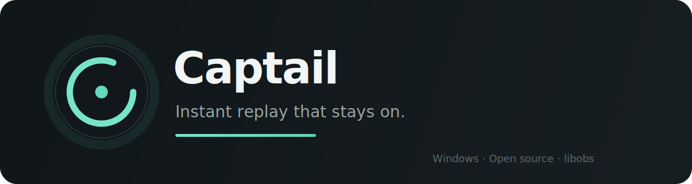
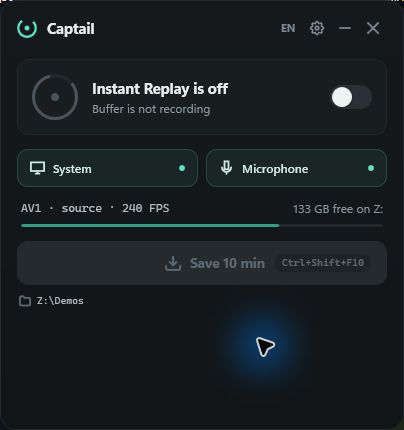

<p align="center">
  
</p>

<p align="center">
  <a href="https://github.com/FaulMit/captail/actions/workflows/ci.yml"></a>
  <a href="https://github.com/FaulMit/captail/releases"></a>
  <a href="LICENSE"></a>
  
</p>

**Captail** is a lightweight, open-source alternative to NVIDIA ShadowPlay Instant Replay. It continuously keeps the latest seconds or minutes in a rolling buffer and saves them when you press a hotkey.

Captail is designed around one rule: **Instant Replay should stay on.** A game crash, game-to-desktop switch, temporary capture failure, protected surface, or recoverable graphics-driver interruption should not silently leave you without a replay. A watchdog monitors the recording pipeline and restarts it when recovery is possible.

<p align="center">
  
</p>

> [!WARNING]
> Captail `v0.1.x` is an early public preview. Core recording works, but bugs and hardware-specific problems are expected. Please report anything that does not work.

## Why Captail?

- **Small, focused UI** — replay state, active source, audio, hotkey, and disk space at a glance.
- **Resilient rolling buffer** — health monitoring and automatic pipeline recovery.
- **DRM-tolerant behavior** — protected sections may appear black, but the buffer is designed to continue instead of disabling itself.
- **Real high-frame-rate capture** — 30, 60, 120, 144, or 240 FPS without generated duplicate frames.
- **Game or desktop capture** — per-game Game Capture or Windows desktop capture.
- **Hardware encoding** — AV1, HEVC, and H.264 through supported NVIDIA NVENC, AMD AMF, or Intel Quick Sync encoders.
- **Flexible audio** — system/game audio and microphone, volume controls, microphone boost, mixed or separate tracks.
- **Local and private** — no account, cloud upload, analytics, or telemetry. Replays stay on your PC.

## How Captail differs from OBS Replay Buffer

Captail uses libobs for capture and encoding, but it is not an OBS Studio frontend.

- Starts directly in the system tray with Windows.
- Requires no scenes, sources, or streaming configuration.
- Monitors capture health and automatically recovers the recording pipeline.
- Switches between focused game capture and desktop capture.
- Stays focused on one job: reliable instant replay.

## Download

Download the latest version from [GitHub Releases](https://github.com/FaulMit/captail/releases).

| Package | Best for | What to do |
| --- | --- | --- |
| `Captail-x.y.z-Setup-win-x64.exe` | Most users | Run installer. Captail and all required runtimes are installed automatically. An uninstaller is added to Windows Settings. |
| `Captail-x.y.z-Portable-win-x64.zip` | Portable use | Extract the complete folder, then run `Captail.exe`. |
| `SHA256SUMS.txt` | Verification | Compare downloaded file SHA-256 before running it. |

Both packages are self-contained. **OBS Studio and .NET do not need to be installed separately.**

> [!NOTE]
> Current binaries are not Authenticode-signed. Windows SmartScreen may show an “Unknown publisher” warning. Verify the SHA-256 checksum and GitHub build provenance before running a release.

## Quick start

1. Install Captail or extract the Portable ZIP.
2. Launch `Captail.exe`.
3. Select **Desktop** or a running game under **Source**.
4. Choose buffer length, codec, resolution, FPS, and audio sources.
5. Keep Instant Replay enabled.
6. Press `Ctrl+Shift+F10` to save the current buffer.

Default hotkeys:

| Action | Hotkey |
| --- | --- |
| Save replay | `Ctrl+Shift+F10` |
| Enable or disable Instant Replay | `Ctrl+Shift+F9` |

Both hotkeys can be changed in Settings.

## Features

### Capture and video

- Selected-process Game Capture with anti-cheat compatibility mode.
- Windows Graphics Capture for desktop recording.
- AV1, HEVC/H.265, and H.264/AVC when supported by GPU and driver.
- Automatic GPU and encoder capability detection.
- GPU-aware encoder profiles for NVIDIA, AMD, and Intel hardware.
- Adaptive automatic bitrate or manual bitrate.
- Source resolution, 720p, 1080p, 1440p, or 4K.
- 30, 60, 120, 144, and 240 FPS.
- Duration limit and optional maximum replay-buffer size.

### Audio

- System audio or selected-game audio.
- Microphone capture.
- Separate system/game and microphone volume controls.
- Microphone boost up to +20 dB.
- One mixed track or separate audio tracks.
- AAC in fragmented MP4 or Opus in MKV.

### Windows integration

- Configurable global hotkeys.
- System tray with double-click restore.
- Start with Windows.
- Native overlay notifications for replay state and saved clips.
- Single-instance protection.
- English interface by default, with live English/Russian switching.

### Reliability

- Recording-pipeline watchdog.
- Automatic replay restart after recoverable capture or encoder failure.
- Progressive retry delay when the graphics driver is temporarily unavailable.
- Fragmented MP4 output to reduce the risk of losing an entire file after interruption.
- Protected/DRM surfaces may become black while the rolling buffer continues.

## Hardware compatibility

| Hardware | Status |
| --- | --- |
| NVIDIA GeForce RTX 50 series | Tested |
| NVIDIA GeForce RTX 40 series | Tested |
| Older NVIDIA GPUs | Not yet verified; expected to work when supported by libobs/NVENC |
| AMD GPUs | Capability detection implemented; public hardware testing needed |
| Intel GPUs | Capability detection implemented; public hardware testing needed |

Captail currently targets **Windows 10 version 2004 or newer and Windows 11, x64**.

Codec availability depends on GPU generation and installed graphics driver. Captail hides unavailable codecs automatically.

## Known limitations

- This is the first public version. Expect bugs.
- Captail is currently unsigned, so SmartScreen may warn on first launch.
- Unique 240 FPS frames require the game and capture path to produce 240 distinct frames. Desktop capture is limited by desktop/monitor presentation rate.
- Some games or anti-cheat configurations may block Game Capture.
- DRM-protected video cannot be captured; protected regions may be black.
- NVIDIA generations older than RTX 40, AMD, and Intel need broader real-world testing.

## Reporting bugs

Feedback is especially valuable during this preview.

1. Check [existing issues](https://github.com/FaulMit/captail/issues).
2. Open a [bug report](https://github.com/FaulMit/captail/issues/new/choose).
3. Include Captail version, Windows version, GPU, driver version, source, codec, FPS, resolution, and reproduction steps.
4. Attach `%APPDATA%\Captail\log.txt` when possible. Review it first and remove personal paths or other sensitive information.

Requests for older NVIDIA, AMD, and Intel testing are welcome even when everything works.

## Building from source

Requirements:

- Windows 10/11 x64
- .NET 9 SDK
- Visual Studio 2022 Build Tools with **Desktop development with C++**
- CMake 3.20+

```powershell
git clone https://github.com/FaulMit/captail.git
cd captail
.\tools\AcquireObsRuntime.ps1
dotnet build .\Captail.sln -c Release
```

Create local release packages:

```powershell
.\tools\BuildRelease.ps1 -Version 0.1.0 -InnoSetupCompiler "C:\Program Files\Inno Setup 7\ISCC.exe"
```

See [CONTRIBUTING.md](CONTRIBUTING.md) for development guidelines and [docs/RELEASING.md](docs/RELEASING.md) for the automated release process.

## Architecture

- `ObsReplayEngine.cs` — libobs lifecycle, sources, scene, encoders, and Replay Buffer.
- `ObsNative.cs` — focused P/Invoke bindings for libobs.
- `native/ObsBridge` — safe bridge for variadic OBS logging.
- `native/ObsCaptureFixture` — D3D11 fixture for Game Capture and high-FPS validation.
- `App.xaml.cs` — tray, hotkeys, notifications, single-instance behavior, watchdog, and recovery.
- `SettingsWindow.*` — compact WPF interface.

## License and attribution

Captail is licensed under **GNU GPL-2.0-or-later**. See [LICENSE](LICENSE).

Captail uses libobs and selected OBS Studio runtime components. See [THIRD_PARTY_NOTICES.md](THIRD_PARTY_NOTICES.md).

Captail is not affiliated with or endorsed by NVIDIA or OBS Project. NVIDIA and ShadowPlay are trademarks of NVIDIA Corporation.
